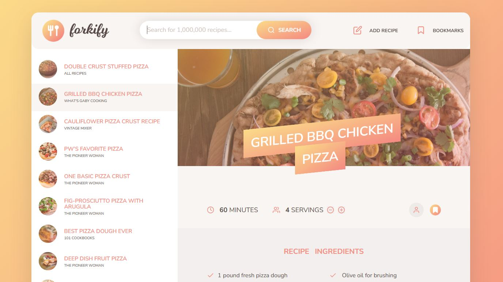
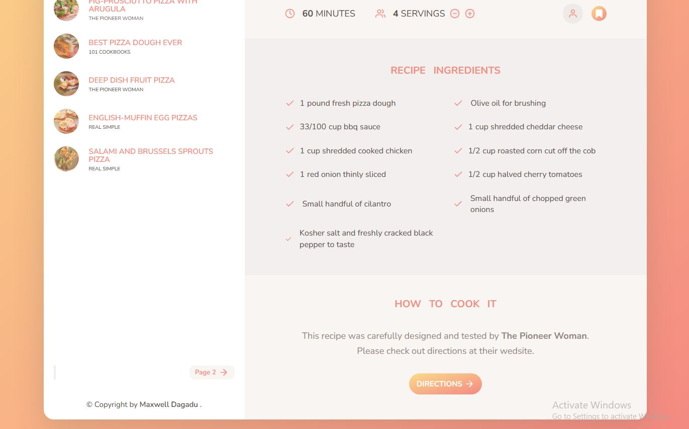
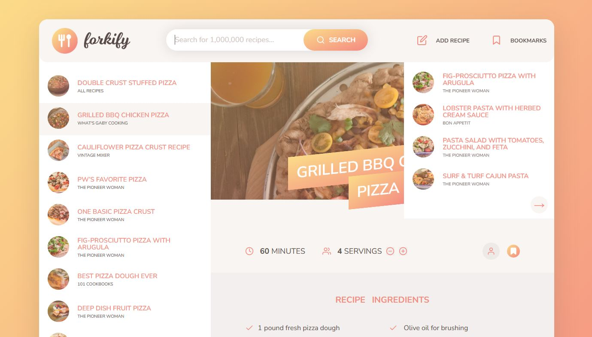
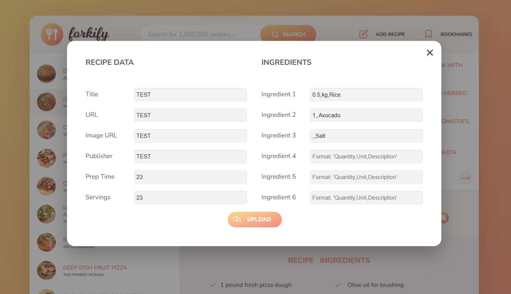

# Forkify Recipe Cooking App

This web-app showcases how your favorite recipes are been prepared.
There's an extreme detail about what exact ingredients should be used
and their prefered quantity to achieve your desired meal.

![home page] (./src/img/app/shot-1.JPG)

# Rendering a Recipe

Down below is the recipe being rendered in the Ui. After you run a search query
and clicks on any of the recipe, it renders.

# Bookmark a Recipe

You can bookmark a favorite recipe so it becomes super easy for you to access.
Remove it from the bookmark and the list will be updated in the Ui.

# Upload your own recipe

A user can upload a recipe to the API. After submiting the form, the recipe will be marked as 
user generated. It's also added to the bookmark.

